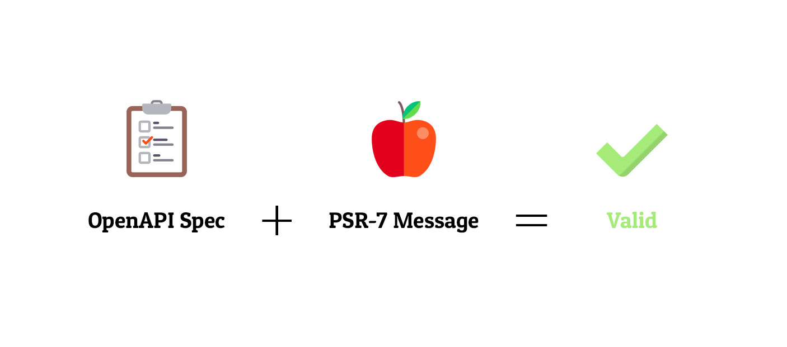

[](https://packagist.org/packages/league/openapi-psr7-validator)
[](https://travis-ci.org/thephpleague/openapi-psr7-validator)
[](https://packagist.org/packages/lezhnev74/openapi-psr7-validator)


# OpenAPI PSR-7 Message (HTTP Request/Response) Validator
This package can validate PSR-7 messages against OpenAPI (3.0.x) specifications 
expressed in YAML or JSON. 



## Installation
```
composer require league/openapi-psr7-validator
```

## OpenAPI (OAS) Terms
There are some specific terms that are used in the package. These terms come 
from OpenAPI:
- `specification` - an OpenAPI document describing an API, expressed in JSON or YAML file
- `data` - actual thing that we validate against a specification, including body and metadata
- `schema` - the part of the specification that describes the body of the request / response
- `keyword` - properties that are used to describe the instance are called key
words, or schema keywords
- `path` - a relative path to an individual endpoint
- `operation` - a method that we apply on the path (like `get /password`)
- `response` - described response (includes status code, content types etc)


## How To Validate

### ServerRequest Message
You can validate `\Psr\Http\Message\ServerRequestInterface` instance like this:

```php
$yamlFile = "api.yaml";
$jsonFile = "api.json";

$validator = (new \League\OpenAPIValidation\PSR7\ValidatorBuilder)->fromYamlFile($yamlFile)->getServerRequestValidator();
#or
$validator = (new \League\OpenAPIValidation\PSR7\ValidatorBuilder)->fromYaml(file_get_contents($yamlFile))->getServerRequestValidator();
#or
$validator = (new \League\OpenAPIValidation\PSR7\ValidatorBuilder)->fromJson(file_get_contents($jsonFile))->getServerRequestValidator();
#or
$validator = (new \League\OpenAPIValidation\PSR7\ValidatorBuilder)->fromJsonFile($jsonFile)->getServerRequestValidator();
#or
$schema = new \cebe\openapi\spec\OpenApi(); // generate schema object by hand
$validator = (new \League\OpenAPIValidation\PSR7\ValidatorBuilder)->fromSchema($schema)->getServerRequestValidator();

$match = $validator->validate($request);
```

As a result you would get and `OperationAddress $match` which has matched the given request. If you already know
the operation which should match your request (i.e you have routing in your project), you can use 
`RouterRequestValidator`

```php
$address = new \League\OpenAPIValidation\PSR7\OperationAddress('/some/operation', 'post');

$validator = (new \League\OpenAPIValidation\PSR7\ValidatorBuilder)->fromSchema($schema)->getRoutedRequestValidator();

$validator->validate($address, $request);
```

This would simplify validation a lot and give you more performance.

### Request Message
You can validate `\Psr\Http\Message\RequestInterface` instance like this:

```php
$yamlFile = "api.yaml";
$jsonFile = "api.json";

$validator = (new \League\OpenAPIValidation\PSR7\ValidatorBuilder)->fromYamlFile($yamlFile)->getRequestValidator();
#or
$validator = (new \League\OpenAPIValidation\PSR7\ValidatorBuilder)->fromYaml(file_get_contents($yamlFile))->getRequestValidator();
#or
$validator = (new \League\OpenAPIValidation\PSR7\ValidatorBuilder)->fromJson(file_get_contents($jsonFile))->getRequestValidator();
#or
$validator = (new \League\OpenAPIValidation\PSR7\ValidatorBuilder)->fromJsonFile($jsonFile)->getRequestValidator();
#or
$schema = new \cebe\openapi\spec\OpenApi(); // generate schema object by hand
$validator = (new \League\OpenAPIValidation\PSR7\ValidatorBuilder)->fromSchema($schema)->getRequestValidator();

$match = $validator->validate($request);
```

### Response Message
Validation of `\Psr\Http\Message\ResponseInterface` is a bit more complicated
. Because you need not only YAML file and Response itself, but also you need 
to know which operation this response belongs to (in terms of OpenAPI).

Example:

```php
$yamlFile = "api.yaml";
$jsonFile = "api.json";

$validator = (new \League\OpenAPIValidation\PSR7\ValidatorBuilder)->fromYamlFile($yamlFile)->getResponseValidator();
#or
$validator = (new \League\OpenAPIValidation\PSR7\ValidatorBuilder)->fromYaml(file_get_contents($yamlFile))->getResponseValidator();
#or
$validator = (new \League\OpenAPIValidation\PSR7\ValidatorBuilder)->fromJson(file_get_contents($jsonFile))->getResponseValidator();
#or
$validator = (new \League\OpenAPIValidation\PSR7\ValidatorBuilder)->fromJsonFile($jsonFile)->getResponseValidator();
#or
$schema = new \cebe\openapi\spec\OpenApi(); // generate schema object by hand
$validator = (new \League\OpenAPIValidation\PSR7\ValidatorBuilder)->fromSchema($schema)->getResponseValidator();

$operation = new \League\OpenAPIValidation\PSR7\OperationAddress('/password/gen', 'get') ;

$validator->validate($operation, $response);
```

### Reuse Schema After Validation

`\League\OpenAPIValidation\PSR7\ValidatorBuilder` reads and compiles schema in memory as instance of `\cebe\openapi\spec\OpenApi`. Validators use this instance to perform validation logic. You can reuse this instance after the validation like this:

```php
$validator = (new \League\OpenAPIValidation\PSR7\ValidatorBuilder)->fromYamlFile($yamlFile)->getServerRequestValidator();
# or
$validator = (new \League\OpenAPIValidation\PSR7\ValidatorBuilder)->fromYamlFile($yamlFile)->getResponseValidator();

/** @var \cebe\openapi\spec\OpenApi */
$openApi = $validator->getSchema();
```

### PSR-15 Middleware
PSR-15 middleware can be used like this:

```php
$yamlFile = 'api.yaml';
$jsonFile = 'api.json';

$psr15Middleware = (new \League\OpenAPIValidation\PSR15\ValidationMiddlewareBuilder)->fromYamlFile($yamlFile)->getValidationMiddleware();
#or
$psr15Middleware = (new \League\OpenAPIValidation\PSR15\ValidationMiddlewareBuilder)->fromYaml(file_get_contents($yamlFile))->getValidationMiddleware();
#or
$psr15Middleware = (new \League\OpenAPIValidation\PSR15\ValidationMiddlewareBuilder)->fromJsonFile($jsonFile)->getValidationMiddleware();
#or
$psr15Middleware = (new \League\OpenAPIValidation\PSR15\ValidationMiddlewareBuilder)->fromJson(file_get_contents($jsonFile))->getValidationMiddleware();
#or
$schema = new \cebe\openapi\spec\OpenApi(); // generate schema object by hand
$validator = (new \League\OpenAPIValidation\PSR7\ValidationMiddlewareBuilder)->fromSchema($schema)->getValidationMiddleware();
```

### SlimFramework Middleware
Slim framework uses slightly different middleware interface, so here is an 
adapter which you can use like this:

```php
$yamlFile = 'api.yaml';
$jsonFile = 'api.json';

$psr15Middleware = (new \League\OpenAPIValidation\PSR15\ValidationMiddlewareBuilder)->fromYamlFile($yamlFile)->getValidationMiddleware();
#or
$psr15Middleware = (new \League\OpenAPIValidation\PSR15\ValidationMiddlewareBuilder)->fromYaml(file_get_contents($yamlFile))->getValidationMiddleware();
#or
$psr15Middleware = (new \League\OpenAPIValidation\PSR15\ValidationMiddlewareBuilder)->fromJsonFile($jsonFile)->getValidationMiddleware();
#or
$psr15Middleware = (new \League\OpenAPIValidation\PSR15\ValidationMiddlewareBuilder)->fromJson(file_get_contents($jsonFile))->getValidationMiddleware();
#or
$schema = new \cebe\openapi\spec\OpenApi(); // generate schema object by hand
$validator = (new \League\OpenAPIValidation\PSR7\ValidationMiddlewareBuilder)->fromSchema($schema)->getValidationMiddleware();

$slimMiddleware = new \League\OpenAPIValidation\PSR15\SlimAdapter($psr15Middleware);

/** @var \Slim\App $app */
$app->add($slimMiddleware);
```

### Caching Layer / PSR-6 Support
PSR-7 Validator has a built-in caching layer (based on [PSR-6](https://www.php-fig.org/psr/psr-6/) interfaces) which saves time on parsing OpenAPI specs. It is optional.
You enable caching if you pass a configured Cache Pool Object to the static constructor like this:
```php
// Configure a PSR-6 Cache Pool
$cachePool = new ArrayCachePool();

// Pass it as a 2nd argument
$validator = (new \League\OpenAPIValidation\PSR7\ValidatorBuilder)
    ->fromYamlFile($yamlFile)
    ->setCache($cachePool)
    ->getResponseValidator();
# or
$psr15Middleware = (new \OpenAPIValidation\PSR15\ValidationMiddlewareBuilder)
    ->fromYamlFile($yamlFile)
    ->setCache($cachePool)
    ->getValidationMiddleware();
```

You can use `->setCache($pool, $ttl)` call for both PSR-7 and PSR-15 builder in order to set 
[proper expiration ttl in seconds (or explicit `null`)](https://www.php-fig.org/psr/psr-6/#definitions)

If you want take control over the cache key for schema item, or your cache does not support cache key generation by itself
you can `->overrideCacheKey('my_custom_key')` to ensure cache uses key you want.

### Standalone OpenAPI Validator
The package contains a standalone validator which can validate any data 
against an OpenAPI schema like this:

```php
$spec = <<<SPEC
schema:
  type: string
  enum:
  - a
  - b
SPEC;
$data = "c";

$spec   = cebe\openapi\Reader::readFromYaml($spec);
# (optional) reference resolving
$spec->resolveReferences(new ReferenceContext($spec, "/"));
$schema = new cebe\openapi\spec\Schema($spec->schema);

try {
    (new \League\OpenAPIValidation\Schema\SchemaValidator())->validate($data, $schema);
} catch(\League\OpenAPIValidation\Schema\Exception\KeywordMismatch $e) {
    // you can evaluate failure details
    // $e->keyword() == "enum"
    // $e->data() == "c"
    // $e->dataBreadCrumb()->buildChain() -- only for nested data
}
```

## Custom Type Formats
As you know, OpenAPI allows you to add formats to types:

```yaml
schema:
  type: string
  format: binary
```

This package contains a bunch of built-in format validators:
- `string` type:
    - `byte`
    - `date`
    - `date-time`
    - `email`
    - `hostname`
    - `ipv4`
    - `ipv6`
    - `uri`
    - `uuid` (uuid4)
- `number` type
    - `float`
    - `double`

You can also add your own formats. Like this:
```php
# A format validator must be a callable
# It must return bool value (true if format matched the data, false otherwise)

# A callable class:
$customFormat = new class()
{
    function __invoke($value): bool
    {
        return $value === "good value";
    }
};

# Or just a closure:
$customFormat = function ($value): bool {
    return $value === "good value";
};

# Register your callable like this before validating your data
\League\OpenAPIValidation\Schema\TypeFormats\FormatsContainer::registerFormat('string', 'custom', $customFormat);
```

## Exceptions
The package throws a list of various exceptions which you can catch and handle. There are some of them:
- Schema related:
    - `\League\OpenAPIValidation\Schema\Exception\KeywordMismatch` - Indicates that data was not matched against a schema's keyword
        - `\League\OpenAPIValidation\Schema\Exception\TypeMismatch` - Validation for `type` keyword failed against a given data. For example `type:string` and value is `12`
        - `\League\OpenAPIValidation\Schema\Exception\FormatMismatch` - data mismatched a given type format. For example `type: string, format: email` won't match `not-email`.
- PSR7 Messages related:
    - `\League\OpenAPIValidation\PSR7\Exception\NoContentType` - HTTP message(request/response) contains no Content-Type header. General HTTP errors.
    - `\League\OpenAPIValidation\PSR7\Exception\NoPath` - path is not found in the spec
    - `\League\OpenAPIValidation\PSR7\Exception\NoOperation` - operation os not found in the path
    - `\League\OpenAPIValidation\PSR7\Exception\NoResponseCode` - response code not found under the operation in the spec
    - Validation exceptions (check parent exception for possible root causes):
        - `\League\OpenAPIValidation\PSR7\Exception\ValidationFailed` - generic exception for failed PSR-7 message
        - `\League\OpenAPIValidation\PSR7\Exception\Validation\InvalidBody` - body does not match schema
        - `\League\OpenAPIValidation\PSR7\Exception\Validation\InvalidCookies` - cookies does not match schema or missing required cookie
        - `\League\OpenAPIValidation\PSR7\Exception\Validation\InvalidHeaders` - header does not match schema or missing required header
        - `\League\OpenAPIValidation\PSR7\Exception\Validation\InvalidPath` - path does not match pattern or pattern values does not match schema
        - `\League\OpenAPIValidation\PSR7\Exception\Validation\InvalidQueryArgs` - query args does not match schema or missing required argument
        - `\League\OpenAPIValidation\PSR7\Exception\Validation\InvalidSecurity` - request does not match security schema or invalid security headers
    - Request related:
        - `\League\OpenAPIValidation\PSR7\Exception\MultipleOperationsMismatchForRequest` - request matched multiple operations in the spec, 
        but validation failed for all of them.

## Testing
You can run the tests with:

```
vendor/bin/phpunit
```

## Contribution Guide
Feel free to open an Issue or add a Pull request. 
There is a certain code style that this package follows: [doctrine/coding-standard](https://www.doctrine-project.org/projects/doctrine-coding-standard/en/latest/reference/index.html#introduction).

To conform to this style please use a git hook, shipped with this package at `.githooks/pre-commit`.

How to use it:
1. Clone the package locally and navigate to the folder
2. Create a symlink to the hook like this: `ln -s -f ../../.githooks/pre-commit .git/hooks/pre-commit`
3. Add execution rights: `chmod +x .git/hooks/pre-commit`
4. Now commit any new changes and the code will be checked and formatted accordingly.
5. If there are any issues with your code, check the log here: `.phpcs-report.txt`

## Credits
People:
- [Dmitry Lezhnev](https://github.com/lezhnev74)
- [Carsten Brandt](https://github.com/cebe)
- [Samuel Nela](https://github.com/samnela)
- [Pavel Batanov](https://github.com/scaytrase)
- [Christopher L Bray](https://github.com/brayniverse)
- [David Pauli](https://github.com/dpauli)
- [Jason Judge](https://github.com/judgej)
- [Yannick Chenot](https://github.com/osteel)
- [TarasBK](https://github.com/TarasBK)
- [Jason B. Standing](https://github.com/jasonbstanding)
- [Dmytro Demchyna](https://github.com/dmytro-demchyna)
- [Will Chambers](https://github.com/willchambers99)
- [Ignacio](https://github.com/imefisto)
- A big thank you to [Henrik Karlström](https://github.com/hkarlstrom) who kind of inspired me to work on this package. 

Resources:
- Icons made by Freepik, licensed by CC 3.0 BY
- [cebe/php-openapi](https://github.com/cebe/php-openapi) package for Reading OpenAPI files
- [slim3-psr15](https://github.com/bnf/slim3-psr15) package for Slim middleware adapter
 
## License
The MIT License (MIT). Please see `License.md` file for more information.

## TODO
- [ ] Support Discriminator Object (note: apparently, this is not so straightforward, as discriminator can point to any external scheme)
